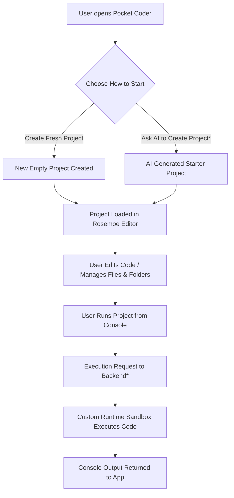

<p align="center">
  
</p>

# 📱 Pocket Coder  
Mobile-first IDE with AI-assisted development — code anywhere, no laptop required.

Pocket Coder transforms an Android device into a portable coding environment, allowing users to write, edit, run, and save programs instantly.  
Designed for accessibility, education, and real development without desktop hardware.  
  
  
  
  

## 🔥 Motivation — Why Pocket Coder Exists

Millions of people want to learn programming, but **not everyone has access to a computer.**
Many rely only on a smartphone — their only connection to the digital world.

They watch tutorials.
They read articles.
They want to build — but **they have no platform to practice on.**

Traditional IDEs are designed for desktops, leaving learners without hardware unable to participate.
This creates a gap where potential developers never get the chance to start.

**Pocket Coder was built to close that gap.**

It enables real coding on mobile — allowing beginners, students, and hobbyists to write, run, and save programs using the device they already own.
No laptop required, no expensive equipment, no barrier to entry.

> Pocket Coder gives people the ability to learn by doing — anytime, anywhere.
## 🎥 Demo — Pocket Coder In Action

Pocket Coder turns your phone into a complete development environment.
Below is a walkthrough of the main interfaces inside the app.

---

### 🏠 Home — Start with an Idea

Describe what you want to build, and Pocket Coder begins the process.


✔ No coding knowledge needed to begin  
✔ AI interprets your prompt and generates real code  
✔ Simple, clean onboarding UI

---

### ✍ Code Editor — Full Project Control

Write, edit, and manage multi-file code directly inside the app.


✔ Multi-file projects  
✔ Syntax-friendly layout  
✔ Designed for both beginners and experienced coders  

---

### 🤖 AI Chat — Build by Talking

Ask for help, request improvements, or generate entire programs.


✔ Conversational coding support  
✔ AI explains logic clearly  
✔ Great for learning and refinement  

---

### ⚡ Console — Run Code & View Results

Execute code and debug output in real time.


✔ Run scripts instantly  
✔ Debug errors quickly  
✔ Learn through real execution feedback  ## 🚀 Features

Pocket Coder provides the core tools needed to build and run code directly from a smartphone — no PC required.

### 🔥 Key Capabilities

| Feature                   | Description                                           |
| ------------------------- | ----------------------------------------------------- |
| 🧠 AI Code Generation*    | Convert natural language prompts into executable code |
| ✍ Multi-File Code Editor  | Edit multiple files with syntax-friendly layout       |
| 💬 AI Chat Assistant*     | Ask questions, fix bugs, request improvements         |
| ⚡ Live Console Execution* | Run programs and view real output instantly           |
| 💾 Local Project Storage  | Save your progress and continue anytime               |
| 🔤 Language Support       | Python, JavaScript, HTML, CSS (expandable)            |
| 🔒 Privacy-First Design   | Execution engine planned for protected backend        |

---

### 🧩 User Experience Highlights

✔ Designed for mobile coding, not just reading  
✔ Build projects, modify files, test instantly  
✔ Learn by doing — not just watching tutorials  
✔ Beginner-friendly + powerful for advanced users  
✔ Works anywhere your phone works

---

> `*` AI + execution features temporarily disabled while backend refactor occurs.
> Will return with sandboxed remote execution and Gemini integration.

---
## 🧠 Tech Stack

Pocket Coder is built using a mobile-first development approach with platform-specific editors and AI integration capability.

### 🔷 Core Technologies

| Component                | Technology Used                                          |
| ------------------------ | -------------------------------------------------------- |
| **Mobile Platform**      | Android (Java + Kotlin)                                  |
| **UI Framework**         | XML Layouts + Material Components                        |
| **Editor Engine**        | **Rosemoe Sora Code Editor** (Open-source GitHub module) |
| **Backend Execution**    | Custom remote execution sandbox *(Offline)*              |
| **Local Storage**        | Internal App Filesystem                                  |
| **AI Model Integration** | **Google Gemini API** *(Temporarily disabled)*           |

---

### Additional Development Tools

| Tool                  | Usage                                          |
| --------------------- | ---------------------------------------------- |
| Android Studio        | Primary IDE for development + design           |
| Gradle                | Build + dependency management                  |
| GitHub                | Source control + public beta showcase          |
| Firebase / Firestore* | Cloud sync + storage logic (planned re-enable) |

* Backend components may be migrated to a private repo for IP protection.

---

### Strengths of the Technology

✔ Lightweight mobile IDE built without heavy dependencies  
✔ Optimized for touchscreen interaction and code readability  
✔ Future-proof integration for cloud execution and generative AI  
✔ Modular — execution layer can be swapped or upgraded later

---
## 🔌 API & Library Reference

Pocket Coder integrates multiple services and libraries to enable code editing, execution, and AI-assisted development.

### Core Integrations

| API / Library                | Purpose                                                                                 | Status                                 |
| ---------------------------- | --------------------------------------------------------------------------------------- | -------------------------------------- |
| **Google Gemini API**        | Code generation, explanation, debugging via AI                                          | Temporarily disabled (backend offline) |
| **Rosemoe Sora Code Editor** | Full Android code editor component — syntax highlighting, multi-file editing, editor UI | Active                                 |
| **Firebase / Firestore***    | Cloud project sync & storage for execution requests                                     | Planned reactivation                   |
| **Custom Execution Engine*** | Secure remote sandbox for code execution & output streaming                             | Private — will move out of public repo |

*These services were functional during development but are offline pending backend refactor + IP protection phase.

---

### Future Integration Plan

| Planned Upgrade                      | Outcome                                                                      |
| ------------------------------------ | ---------------------------------------------------------------------------- |
| **Cloud Sync**                       | Projects saved to account + accessible across devices                        |
| **Community Creations & Sharing**    | Public hub to browse, upload, and run projects made by others                |
| **GitHub Integration**               | Push, pull, commit, and sync PocketCoder projects directly                   |
| **More Programming Languages**       | Expand beyond Python/JS/HTML/CSS into compiled + broader support             |
| **UI/UX Enhancements**               | Cleaner navigation, improved file-tree, better editor workflow               |
| **Advanced Mobile IDE Improvements** | Faster parsing, smarter editing tools, tab enhancements, file refactor tools |
| **Gemini AI Reactivation**           | AI generation restored with improved stability + creative coding flow        |
| **Private Execution Backend**        | Secure isolated runtime with validated code execution                        |
| **iOS App Release**                  | Full dual-platform rollout — learn & code on any device                      |

---
## 🏗 Architecture Overview

Pocket Coder is built as a **mobile-first IDE**, where the Android app handles all user interaction and project management, while a (currently offline) backend is responsible for executing code and powering AI.

### 🔹 High-Level Layers

* **Presentation Layer (Android App)**

  * Screens: Home, Editor, Chat, Console
  * Handles navigation, input, and UI rendering
* **Editor Layer**

  * Built on top of **Rosemoe Sora Code Editor**
  * Manages files, folders, cursor, selection, syntax, etc.
* **Project Layer**

  * Stores project structure, tracks open files
  * Saves/loads project data locally on the device
* **Backend Layer (Planned / Offline)**

  * Handles remote code execution in a sandbox
  * Integrates with **Gemini** for AI assistance
  * Optionally syncs projects via cloud (e.g., Firebase / GitHub integration in future)

---

### 🔁 User Flow Through the System



* AI project generation (Gemini) and backend execution are currently offline in the public beta.

---

### 🧩 Responsibilities by Component

| Component            | Responsibilities                                                               |
| -------------------- | ------------------------------------------------------------------------------ |
| **Home Screen**      | Let user pick between starting fresh or asking AI to create a project          |
| **AI Chat (Gemini)** | Generate starter projects, explain code, assist debugging *(planned/disabled)* |
| **Rosemoe Editor**   | Edit code, open multiple files, manage folders & file tree                     |
| **Project Manager**  | Create, save, load, and organize local projects                                |
| **Console**          | Trigger code runs and display formatted output from backend                    |
| **Backend Runtime**  | Securely executes user code in a sandbox environment *(private & offline)*     |

---

### 🔐 Public vs Private Responsibilities

* **Public Repo (this one):**

  * Android UI + UX
  * Editor integration (Rosemoe)
  * Navigation, console UI, project management logic
  * All client-side interactions

* **Private / Future Backend:**

  * Source-protected execution engine
  * Gemini request handling + code transformation
  * Cloud sync, community sharing, GitHub integration

---

## 📥 Installation & Access

Pocket Coder is currently in **public viewing beta** — backend execution and AI features are offline while the codebase undergoes restructuring and security reinforcement.

### 🔹 Current Availability

| Component                    | Status                         |
| ---------------------------- | ------------------------------ |
| Mobile App (APK)             | 🔄 Coming Back Soon            |
| AI Generation (Gemini)       | 🔌 Offline                     |
| Remote Execution Backend     | 🔐 Private / Under Maintenance |
| Local Project Editing        | ✅ Fully Functional             |
| Code Viewing / UI Navigation | ✅ Fully Functional             |

---

### When APK Returns

Once backend support is re-enabled, installation steps will be:

```md
1. Download the latest APK from the releases page
2. Install on an Android device (Allow unknown sources)
3. Open PocketCoder
4. Create a project OR ask AI to generate one
5. Write code, edit files, and run via console
```

> 📌 An automatic install link + QR code will be added here once APK distribution reactivates.

---

### Planned Distribution Options

| Platform                       | Status                         |
| ------------------------------ | ------------------------------ |
| 📱 Android APK direct download | 📅 Returning soon              |
| 🟢 Google Play Early Beta      | 🚧 Planned                     |
| 🍎 iOS Release                 | 📝 Future rollout              |
| 📦 GitHub Releases             | ✔ Will be used for APK hosting |

---

## 🧭 Roadmap

Pocket Coder is actively evolving into a full mobile IDE with AI, sandbox execution, cloud sync, and cross-platform reach.

### 🔹 Short-Term Roadmap (In Progress)

| Feature                                              | Status                  |
| ---------------------------------------------------- | ----------------------- |
| Restore backend execution engine                     | 🔄 Pending reactivation |
| Reconnect Gemini API for AI coding                   | 🔄 Returning soon       |
| Improve code editor UX + performance                 | 🏗 Ongoing              |
| More supported languages (beyond Python/JS/HTML/CSS) | 🏗 Planned              |

---

### 🔸 Mid-Term Development Goals

| Feature                                 | Objective                                      |
| --------------------------------------- | ---------------------------------------------- |
| Cloud project syncing                   | Code accessible across sessions + devices      |
| GitHub integration                      | Push/pull repositories directly inside the app |
| Community sharing hub                   | Browse, view, run creations made by others     |
| Improved file + project structure tools | Renaming, moving, refactoring inside app       |

---

### 🟣 Long-Term Vision

| Feature                           | Result                                           |
| --------------------------------- | ------------------------------------------------ |
| Private sandbox execution backend | Secure, scalable online code execution           |
| Advanced AI assistant features    | Interactive debugging, live refactor suggestions |
| Modern Mobile IDE experience      | Full dev environment optimized for touchscreen   |
| iOS app release                   | Pocket Coder available across devices/platforms  |

---

> Pocket Coder is a growing project — built to become the most accessible way to learn and write code anywhere.

---

## 📄 License

PocketCoder – Restricted Use License
Copyright (c) 2025 PeterTech. All rights reserved.

This software and its source code are made publicly accessible for
viewing, academic assessment, portfolio evaluation, and recruitment
review purposes only.

Permission is hereby granted to:

* View and read the source code
* Clone the repository for evaluation in a private environment
* Use the application for personal, non-commercial learning only

You MAY NOT:

* Copy, reproduce, or redistribute this software or its source code
* Modify or create derivative applications using this code
* Publish, sell, license, or sublicense any part of this project
* Upload the app (modified or unmodified) to app stores or marketplaces
* Use this code in private, public, or commercial applications
* Claim ownership of any part of the original codebase

Commercial use, redistribution, modification, repackaging, or any
form of appropriation is strictly prohibited. Violation of these
terms may result in legal action.

By accessing or using this repository, you agree to these terms.
If you do not agree, do not clone, download, or view this codebase.
## 📬 Support & Contact

Pocket Coder is currently in a **view-only public beta**, with active development continuing privately.  
If you would like updates, collaboration opportunities, or a technical walk-through of the system:

📨 **Email:**  
👉 [peterpapsotiriou04@gmail.com](mailto:peterpapsotiriou04@gmail.com)

🐙 **GitHub:**  
👉 https://github.com/PeterTech-Dev  

🔹 Recruiters may request a live demonstration  
🔹 Developers may inquire about private backend access after launch  
🔹 Feature suggestions and improvement ideas are welcome  

---

### 🧾 Questions You Can Ask Me

| Topic | Available Response |
|---|---|
| Project breakdown / architecture | ✔ Yes |
| Technical interview walkthrough | ✔ Yes |
| Feature suggestions | ✔ Yes |
| Access to private backend | ⚠ Case-by-case after stable release |
| Code reuse or redistribution | ❌ Not permitted under license terms |

---

### 🔔 Stay Updated

Future announcements including:

- Backend execution reactivation  
- Cloud sync & GitHub integration  
- Community project sharing  
- Play Store + iOS releases  

will be posted here on this repository and shared via updates to the README.
## 🙏 Acknowledgments

Pocket Coder makes use of external tools and open-source contributions that helped bring the project to life.
A special thank you to:

| Resource                        | Contribution                                                                      |
| ------------------------------- | --------------------------------------------------------------------------------- |
| **Sora Code Editor by Rosemoe** | Powerful Android code editor component used as the core project editing interface |

🔗 [https://github.com/Rosemoe/sora-editor](https://github.com/Rosemoe/sora-editor)

---

## 📎 Appendix

This section contains additional notes, future documentation areas, and technical references for those who want deeper insight into Pocket Coder’s design and development.

### 🔧 Internal Notes

* Backend execution engine is currently private for security + IP protection
* AI integration (Gemini) will return when remote execution is restored
* Future versions will use a sandboxed runtime environment for safe code execution

---

### 🔍 Technical Considerations

* Mobile editor is built using **Rosemoe Sora Editor**, which powers syntax parsing and text rendering
* Project system uses Android file-based storage to maintain local code state
* Backend previously supported Python/JS execution — future rebuild will expand language support
* Cloud sync will be implemented after execution core is stable

---

### 🧪 Experimental Features (Planned)

| Feature                    | Notes                                               |
| -------------------------- | --------------------------------------------------- |
| GitHub Sync                | Full push/pull integration from inside the app      |
| Cloud Workspace            | Code stored remotely, device-agnostic               |
| Community Project Sharing  | Users browse and run others' projects               |
| Live AI Debugging          | Stepped fixes + real-time suggestions               |
| Mobile Deep Refactor Tools | Rename, extract, auto-format, structure-aware edits |

These are not yet implemented — but are part of long-term development vision.

---

### 🔐 Sensitive Components

Some modules will not be public in future updates:

| Private Component               | Reason                                    |
| ------------------------------- | ----------------------------------------- |
| Code execution backend          | Prevent reverse engineering / misuse      |
| AI request transformation layer | IP protection + proprietary pipeline      |
| Advanced IDE functions          | Will release only after secure deployment |

---

### 🔌 Related Links

| Resource             | Link                                                                                           |
| -------------------- | ---------------------------------------------------------------------------------------------- |
| Rosemoe Sora Editor  | [https://github.com/Rosemoe/sora-editor](https://github.com/Rosemoe/sora-editor)               |
| Project Landing Page | [https://petertech-dev.github.io/Pocket-Coder/](https://petertech-dev.github.io/Pocket-Coder/) |
| Developer GitHub     | [https://github.com/PeterTech-Dev](https://github.com/PeterTech-Dev)                           |

---

